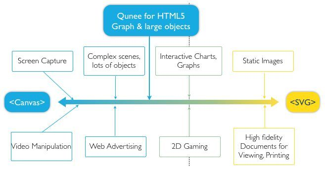
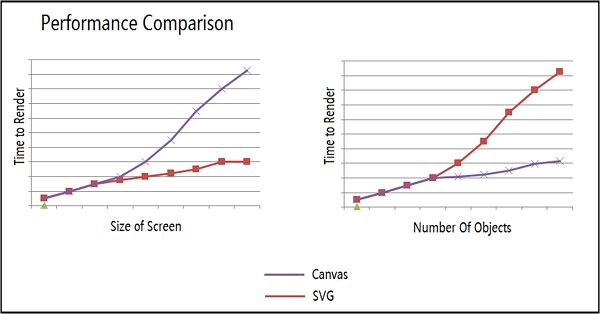

[[HTML5|HTML5]] 提供了 [[Canvas|Canvas]] 和 [[SVG|SVG]] 两种绘图技术，也是多数 Web 图表库使用的渲染技术。Canvas 是基于脚本的，通过 [[JavaScript|JavaScript]] 指令来动态绘图。而 SVG 则是使用 XML 文档来描述矢量图。两者有不同的适用场景。

## 适用场景

Canvas 提供的绘图能力更底层，适合做到像素级的图形处理，能动态渲染和绘制大数据量的图形。而 SVG 抽象层次更高，声明描述式的接口功能更丰富，内置了大量的图形、滤镜和动画等，方便进行文档元素的维护，也能导出为文件脱离浏览器环境使用。

下图从通用层面描述不同渲染技术各自适合的场景。

## 性能差异

之前网上有不少 Canvas 和 SVG 性能对比的文章，得出的结论大体是“Canvas 性能更好，适合更大量数据的渲染”。其实这么说是有失偏颇的。性能对比要看场景。从底层来看，Canvas 的性能受画布尺寸影响更大，而 SVG 的性能受图形元素个数影响更大。下图是微软 MSDN 上给的一个对比图。

而且在小数据量的情况下，SVG 的方案通常内存占用会更小，做缩放、平移等操作的时候往往帧率也更高。

## 定制和交互

比较流行的看法是 SVG 做定制和交互更有优势，因为有类似 DOM 的结构，能快速应用浏览器底层的鼠标事件、CSS 样式、CSS3 动画等。不过基于 Canvas 做上层封装后也能实现类似的定制和交互，并且自由度更高。

## 小结

如果单就图表库的视角来看，选择 Canvas 和 SVG 各有千秋。小画布、大数据量的场景适合用 Canvas，譬如热力图、大数据量的散点图等。如果画布非常大，有缩放、平移等高频的交互，或者移动端对内存占用量非常敏感等场景，可以使用 SVG 的方案。

[查看原网页: g2-v3.antv.vision](https://g2-v3.antv.vision/en/docs/manual/tutorial/renderers)